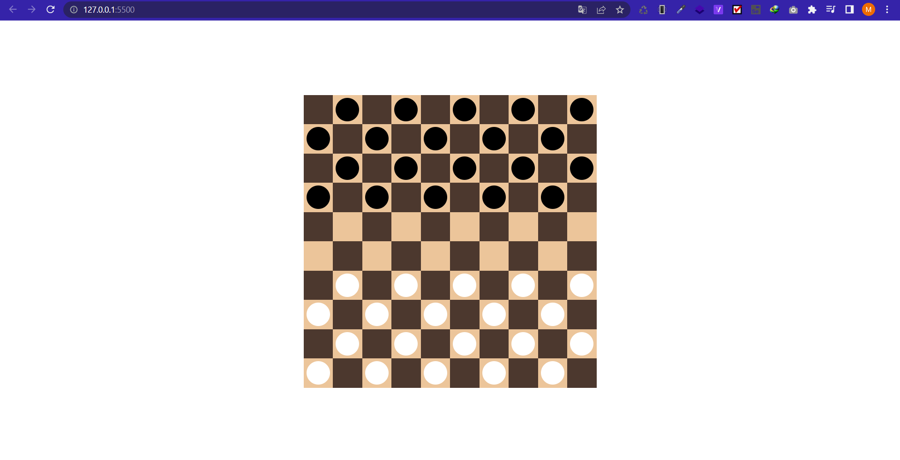

# CHECKERS GAME

Checkers[note 1] (American English), also known as draughts (/drɑːfts, dræfts/; British English), is a group of strategy board games for two players which involve diagonal moves of uniform game pieces and mandatory captures by jumping over opponent pieces. Checkers is developed from alquerque.[1] The term "checkers" derives from the checkered board which the game is played on, whereas "draughts" derives from the verb "to draw" or "to move".[2]

# BOARD

